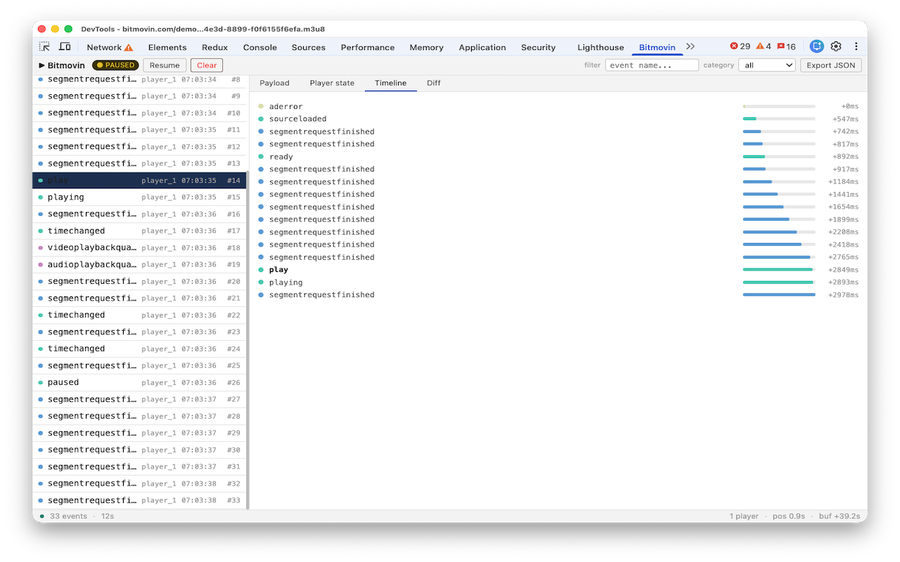

# DevTools for Bitmovin Player

A Chrome extension that adds a **Bitmovin** tab to Chrome DevTools — giving you Redux DevTools-style inspection of every player event on the page.

> **Disclaimer:** This is an independent open-source project and is not affiliated with, endorsed by, or in any way officially connected to Bitmovin GmbH. See [LICENSE](./LICENSE) for details.

---




## Live Demo

Try the panel UI before installing: **[Live Demo →](https://jimipedros.github.io/bitmovin-devtools)**

---

## Features

- **Live event stream** — every `player.on(...)` event captured in real-time, colour-coded by category
- **Payload inspector** — syntax-highlighted JSON for each event's data
- **Player state snapshot** — position, buffer, bitrate, isPlaying, isStalling and more, captured at the exact moment each event fired
- **Timeline view** — relative timing of surrounding events
- **Diff view** — what changed in player state between two consecutive events
- **Filter** — by event name or category (playback, buffer, quality, ad, error, DRM, UI)
- **Pause / Resume** — freeze the stream without losing events
- **Export JSON** — download the full session log
- **Multi-player** — tracks multiple player instances on the same page

---

## Installation

### From the Chrome Web Store

Search for **DevTools for Bitmovin Player** and click Install. *(link coming soon)*

### Load unpacked (for development)

1. Clone or download this repo
2. Go to `chrome://extensions` in Chrome
3. Enable **Developer mode** (top-right toggle)
4. Click **Load unpacked** and select the repo folder
5. Open any page using the Bitmovin Player
6. Open Chrome DevTools (`F12` / `Cmd+Opt+I`) and click the **Bitmovin** tab

---

## Setup

How you connect the extension to your player depends on how your app is structured.

### Option A — Player on `window` (plain HTML / script tag)

If you create your player in a plain HTML page or a script that runs in the global scope, **no extra setup is needed.** The extension automatically detects `window.bitmovin.player.Player` and patches the constructor before your code runs.

```html
<script src="https://cdn.bitmovin.com/player/web/8/bitmovinplayer.js"></script>
<script>
  var player = new bitmovin.player.Player(document.getElementById('player'), {
    key: 'YOUR_LICENSE_KEY',
    source: {
      dash: 'https://cdn.bitmovin.com/content/assets/sintel/sintel.mpd',
    },
  });
  // Events appear in the Bitmovin DevTools panel automatically.
</script>
```

Open DevTools → **Bitmovin** tab and you should see events as soon as the player loads.

---

### Option B — React application (or any bundled app)

In a React app the Bitmovin SDK is imported as a module and the player instance lives inside a component or context — it never touches `window.bitmovin`. The extension cannot find it automatically, so you register it manually using the bridge.

**Step 1 — Copy the bridge file into your project**

Copy [`bridge/bitmovin-devtools-bridge.js`](./bridge/bitmovin-devtools-bridge.js) anywhere in your source tree, for example `src/utils/bitmovin-devtools-bridge.js`.

The bridge is a tiny file — it does nothing if the extension is not installed, so it is safe to ship in production.

**Step 2 — Call `registerWithDevtools` after the player is created**

```jsx
import { Player } from 'bitmovin-player';
import { registerWithDevtools } from './utils/bitmovin-devtools-bridge';

function VideoPlayer() {
  const containerRef = useRef(null);

  useEffect(() => {
    const player = new Player(containerRef.current, {
      key: 'YOUR_LICENSE_KEY',
    });

    player.load({
      dash: 'https://cdn.bitmovin.com/content/assets/sintel/sintel.mpd',
    });

    // Register the instance with the DevTools extension.
    // The second argument is optional — use it to label the player
    // if you have more than one on the page.
    registerWithDevtools(player, { id: 'main-player' });

    return () => player.destroy();
  }, []);

  return <div ref={containerRef} />;
}
```

**Step 3 — Open DevTools**

Open Chrome DevTools → **Bitmovin** tab. Events will appear as soon as the player starts.

---

### Option C — Angular / Vue / other frameworks

The same bridge approach works in any framework. The only requirement is that you call `registerWithDevtools(player)` after `new Player(...)` returns.

```ts
// Angular service example
import { registerWithDevtools } from './bitmovin-devtools-bridge';

@Injectable({ providedIn: 'root' })
export class PlayerService {
  private player: PlayerAPI;

  init(container: HTMLElement) {
    this.player = new Player(container, config);
    registerWithDevtools(this.player, { id: 'angular-player' });
  }
}
```

```ts
// Vue composable example
import { registerWithDevtools } from './bitmovin-devtools-bridge';

export function usePlayer(container: Ref<HTMLElement>) {
  onMounted(() => {
    const player = new Player(container.value, config);
    registerWithDevtools(player, { id: 'vue-player' });
  });
}
```

---

## The Bridge File

The bridge is intentionally tiny. It checks for the extension's global hook and calls into it — if the extension is not installed, it exits immediately with no side effects.

```js
// bitmovin-devtools-bridge.js

export function registerWithDevtools(player, options = {}) {
  if (typeof window === 'undefined') return;          // SSR guard
  if (!window.__BITMOVIN_DEVTOOLS_HOOK__) return;     // extension not installed
  window.__BITMOVIN_DEVTOOLS_HOOK__.registerPlayer(player, options);
}

export function emitCustomEvent(eventName, data) {
  if (typeof window === 'undefined') return;
  if (!window.__BITMOVIN_DEVTOOLS_HOOK__) return;
  window.__BITMOVIN_DEVTOOLS_HOOK__.emit(eventName, data);
}
```

You can also use `emitCustomEvent` to send your own events into the panel — useful for logging app-level state changes alongside player events.

```js
emitCustomEvent('content_metadata_loaded', { title: 'Sintel', duration: 888 });
```

---

## How It Works

The extension injects a script (`hook.js`) into the page before any other code runs. Depending on how your app is set up, player instances are detected in one of three ways:

| Method | When it applies |
|---|---|
| `window.__BITMOVIN_DEVTOOLS_HOOK__.registerPlayer()` | React / Angular / Vue / any bundled app using the bridge |
| `window.bitmovin.player.Player` constructor patch | Plain HTML / script tag integrations |
| `window.bitmovin.player.instances` scan | Instances created before the hook loaded |

Once a player is detected, every event fired via `.on()` is intercepted, serialised with a player state snapshot, and forwarded to the DevTools panel.

```
page context      →  window.postMessage
content script    →  chrome.runtime.sendMessage
service worker    →  port.postMessage (buffered per tab)
devtools panel    →  renders event list + detail views
```

---

## Compatibility

- Bitmovin Player **v8** and **v9** (Web SDK)
- Chrome 88+
- Works with plain HTML, React, Angular, Vue, and any other framework via the bridge

---

## Contributing

Pull requests are welcome. For significant changes please open an issue first to discuss what you'd like to change.

---

## License

[MIT](./LICENSE) — free to use, modify, and distribute.

This project is not affiliated with Bitmovin GmbH. "Bitmovin" is a registered trademark of Bitmovin GmbH.
